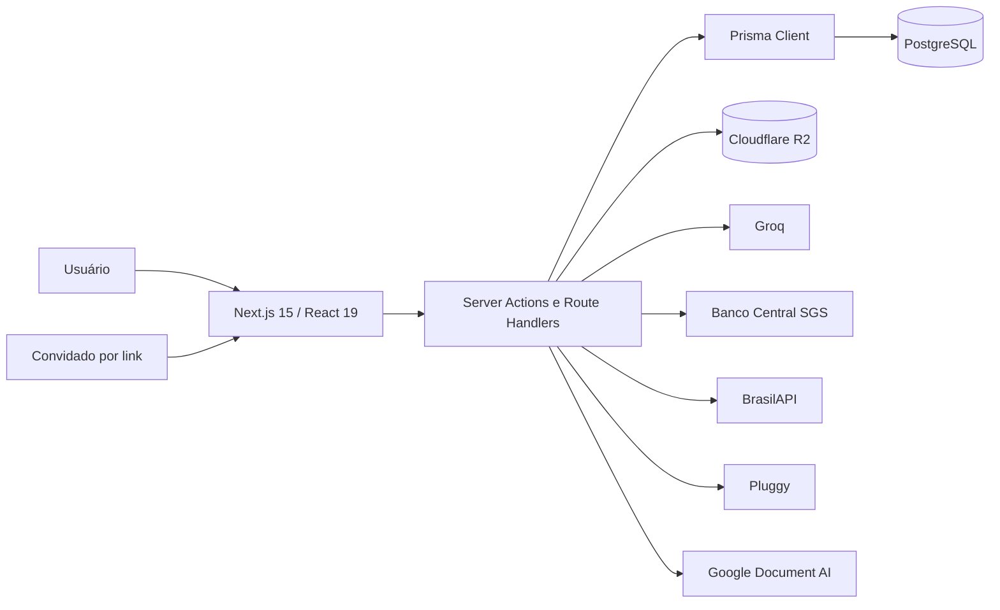

# Arquitetura do Finora

Estado real do repositório em 12 de julho de 2026. Este documento descreve apenas comportamento executável ou estruturas efetivamente versionadas. Dependências externas não configuradas são marcadas como opcionais, e recursos fiscais sem integração oficial são tratados como simulação.

## 1. Visão do sistema

O Finora é um monólito full stack. O mesmo processo Next.js entrega a interface React, renderiza a página autenticada no servidor, executa Server Actions e Route Handlers e acessa PostgreSQL pelo Prisma.



Não existem microsserviços internos, GraphQL, WebSocket, fila ou worker separado. Webhooks Pluggy são processados no próprio processo web. Cache econômico e idempotência ficam no PostgreSQL; o cache de API key Pluggy é apenas em memória por instância.

## 2. Stack e execução

| Camada            | Implementação                                                  |
| ----------------- | -------------------------------------------------------------- |
| Runtime           | Node.js 22+                                                    |
| Web               | Next.js 15 App Router, saída `standalone`                      |
| UI                | React 19, Server/Client Components, CSS global próprio         |
| Tipagem/validação | TypeScript estrito e Zod                                       |
| Dados             | PostgreSQL + Prisma 6                                          |
| Auth              | bcryptjs, jose/JWT HS256, cookie HTTP-only e sessão persistida |
| IA                | Groq SDK com JSON Schema                                       |
| Arquivos          | AWS SDK S3 apontado ao Cloudflare R2                           |
| Open Finance      | API Pluggy + Pluggy Connect SDK                                |
| OCR               | Google Document AI via `google-auth-library`                   |
| Dados públicos    | SGS/Banco Central e BrasilAPI                                  |
| Documentos        | SheetJS e fast-xml-parser                                      |
| Deploy            | Docker multi-stage e Railway                                   |

O container final roda como usuário `nextjs`. Antes de iniciar `server.js`, executa `prisma migrate deploy`.

## 3. Fronteira de dados e navegação

`Household` é a fronteira de isolamento. A sessão resolve `user.memberships[0]`; todas as mutações financeiras relevantes reaplicam o `householdId` no servidor. Ainda não existe seletor de família.

`app/page.tsx` é dinâmica e consulta em paralelo cadastros, lançamentos, agregados, orçamento, fechamento, dívidas, transferências, Open Finance, IVA e alertas. `Decimal` e `Date` são serializados antes de chegar ao `Dashboard` cliente.

Visões atuais:

- Central financeira;
- Faturas por cartão;
- Lançamentos;
- Orçamento e fechamento;
- Central de dívidas;
- Central bancária/Open Finance;
- Central IVA;
- Planejamento de 12 meses;
- Pessoas e acertos;
- Contas e transferências;
- Importação e conciliação;
- Configurações e segurança.

A visão é selecionada pelo hash da URL. Mês e paginação usam query string. A lista mensal carrega 20 itens por página; busca/filtro no cliente operam somente nessa página.

## 4. Identidade, sessão e segurança

### Cadastro e login

- e-mail é normalizado para minúsculas e buscado sem diferenciar caixa;
- senha deve ter 10–128 caracteres;
- novo cadastro cria `User`, `Household` e `Membership OWNER`;
- bcrypt usa custo 12;
- HIBP Pwned Passwords usa k-anonymity: só o prefixo SHA-1 é enviado, com padding; indisponibilidade externa não bloqueia cadastro/troca;
- `LoginThrottle` guarda hash SHA-256 do e-mail, nunca o e-mail; após cinco falhas dentro de 15 minutos, bloqueia por 15 minutos.

### Sessão

O servidor gera 32 bytes aleatórios, persiste apenas SHA-256 em `Session.tokenHash` e coloca o valor cru dentro de JWT HS256 no cookie `finora_session`. O cookie é HTTP-only, `SameSite=Lax`, `Secure` em produção e dura 30 dias. Logout remove cookie e linha da sessão. Troca de senha valida a senha atual, verifica vazamento, troca o hash e encerra todas as sessões.

Em produção, `AUTH_SECRET` ausente ou menor que 32 caracteres interrompe a autenticação. O fallback existe somente em desenvolvimento.

### Headers

Todas as respostas recebem `nosniff`, `DENY` para frames, política de referrer, COOP e bloqueio de câmera, microfone, geolocalização e Payment API. O header `X-Powered-By` é desativado. Ainda não há CSP completa, verificação de e-mail, recuperação de senha ou 2FA.

### Papéis

| Operação                              | OWNER | ADMIN | EDITOR |      VIEWER/GUEST      |
| ------------------------------------- | :---: | :---: | :----: | :--------------------: |
| leitura financeira                    |  sim  |  sim  |  sim   |          sim           |
| lançamento, anexo, importação, acerto |  sim  |  sim  |  sim   |          não           |
| orçamento e simulações                |  sim  |  sim  |  sim   | não para persistir IVA |
| conexão/revogação Open Finance        |  sim  |  sim  |  não   |          não           |
| fechamento/reset mensal               |  sim  |  sim  |  não   |          não           |
| reset total                           |  sim  |  não  |  não   |          não           |
| compartilhamento mensal               |  sim  |  sim  |  não   |          não           |
| Conselho Econômico                    |  sim  |  sim  |  sim   |          sim           |

`GUEST` autenticado não é o convidado de link; o convidado de link não possui usuário nem membership.

## 5. Núcleo financeiro

### Lançamentos e parcelas

`Transaction` representa uma parcela/competência. Despesas e receitas aceitam cartão, conta, categoria, responsável, vencimento, observação e split.

O parcelamento divide o total em centavos sem perder resto. Datas avançam por mês preservando o dia quando possível e usando o último dia do mês quando necessário. A primeira parcela nasce `PENDING`; futuras, `PLANNED`. Descrição recebe `· n/total`. IDs enviados pelo cliente são revalidados dentro da família.

Edição é por parcela, não por série. Pagamento define `PAID/paidAt`. Cancelamento define `CANCELED` e dispensa splits ainda abertos. Não há job automático para transformar vencidos em `OVERDUE`.

### Faturas

Fatura é um agregado de despesas por cartão, mês e status. Limite, fechamento e vencimento são metadados; o sistema não simula ciclo real da operadora.

### Contas e transferências

Saldo exibido:

```text
saldo inicial
+ receitas PAID vinculadas
- despesas PAID vinculadas
+ transferências recebidas
- transferências enviadas
```

Transferência usa `AccountTransfer` e não duplica a movimentação como receita/despesa. Não há extrato bancário interno completo por conta.

### Pessoas e splits

Cada `Split` guarda total, pago e status. `SplitPayment` registra pagamentos parciais. O usuário pode liquidar parcialmente/totalmente ou dispensar o restante. O cálculo aberto sempre usa `amount - paidAmount`.

### Orçamento e fechamento

`MonthlyBudget` define limite por categoria/mês. A tela compara orçamento com despesas e aponta sem cartão, sem categoria e pendências. `FinancialMonthClose` guarda snapshot com receitas, despesas, pago, pendente, orçamento, acertos e contagens. Reabrir remove o snapshot. Fechar não bloqueia alterações posteriores; portanto o snapshot é evidência histórica, não trava contábil.

### Dívidas

`Debt` e `DebtPayment` controlam saldo informado, taxa mensal, parcela, mínimo, vencimento e estado. O simulador determinístico aplica juros mês a mês em centavos, detecta parcela que não cobre juros e compara pagamento normal com adicional.

O endpoint de referência carrega as séries SGS 432, 433, 25435, 25464, 25477, 25478 e 25463. `EconomicIndicator` mantém cache de 24 horas; se o Banco Central falhar, usa o último valor persistido. Comparação é referência geral, nunca proposta de crédito.

### Feriados

`GET /api/reference/holidays?year=` consulta a BrasilAPI e mantém cache HTTP de sete dias. O cliente combina feriados nacionais e fins de semana para alertar vencimentos; não muda datas automaticamente e não inclui feriados estaduais/municipais.

## 6. Importação e R2

### Excel/CSV

O navegador lê a primeira aba com SheetJS. O parser reconhece a planilha legada e tabelas com cabeçalhos equivalentes. O legado concilia totais por grupo e geral em centavos; formato tabular usa o total derivado das linhas.

Fluxo:

1. `POST /api/import-file` valida papel, extensão/MIME e 10 MB;
2. servidor calcula SHA-256 e preserva original no R2;
3. cliente envia linhas normalizadas, hash e key à Server Action;
4. servidor revalida schema, somas, duplicidade e escopo;
5. cria `ImportBatch`, cadastros ausentes e `Transaction`;
6. rollback remove transações e marca o lote, mas preserva o original.

O servidor ainda não relê o objeto para provar que o payload corresponde ao arquivo armazenado.

### Comprovantes e OCR

O navegador solicita URL PUT assinada de cinco minutos, com `Content-Type` e tamanho máximo de 10 MB. Após PUT, `registerAttachment` valida a transação e o prefixo da key. Download gera URL GET temporária no servidor. Exclusão remove R2 e banco.

OCR é manual. `POST /api/attachments/[id]/ocr` lê o objeto privado, chama Google Document AI, persiste texto, campos, sugestão canônica, confiança, estado e erro. Confiança abaixo de 85% vira `NEEDS_REVIEW`. “Usar dados” apenas abre a edição com descrição, valor e datas sugeridos; salvar continua sendo decisão humana.

Reset mensal/total tenta remover comprovantes e XML fiscais com `Promise.allSettled`; uma falha externa não desfaz a exclusão no banco. Originais de importação continuam preservados.

## 7. Open Finance via Pluggy

O módulo é opcional e comercial. Variáveis: `PLUGGY_CLIENT_ID`, `PLUGGY_CLIENT_SECRET` e `PLUGGY_WEBHOOK_SECRET`.

### Conexão

1. OWNER/ADMIN pede connect token de curta duração;
2. token inclui `clientUserId=householdId` e prevenção de duplicidade;
3. Pluggy Connect coleta consentimento;
4. sucesso envia `itemId` ao servidor;
5. servidor confirma `clientUserId`, cria/atualiza `FinancialConnection` e `ConsentRecord`;
6. contas e até as transações retornadas pelo provider são sincronizadas.

`ExternalAccount` e `ExternalTransaction` preservam dados normalizados e JSON bruto. `SyncJob` registra início, resultado e erro. Dados externos ficam separados até importação explícita.

### Conciliação

O score determinístico pondera:

- valor absoluto: 55%;
- proximidade de data: 25%;
- similaridade de tokens normalizados: 20%.

Somente score ≥ 0,72 gera `TransactionMatch SUGGESTED`. O usuário confirma/rejeita. Uma movimentação sem match pode virar lançamento por ação explícita; `externalRef` e índice único do match evitam importação duplicada.

### Webhook e revogação

`POST /api/open-finance/webhook` exige `x-finora-webhook-secret`, guarda `WebhookEvent` idempotente e trata atualização, exclusão, erro e necessidade de reautenticação. O segredo é um controle adicional configurado pelo operador; a rota não implementa assinatura nativa do provider.

Revogar tenta excluir o Item na Pluggy, marca conexão/consentimento revogados e preserva os dados sincronizados para auditoria. O usuário pode resetar tudo para removê-los.

Limites: não há scheduler próprio, paginação incremental persistida por cursor, investimentos/empréstimos em tela dedicada, teste automatizado contra Pluggy ou garantia de produtos por instituição.

## 8. Central IVA

O módulo é deliberadamente dividido em modo família e empresa/profissional. Ele não é emissor, ERP, escrituração ou declaração fiscal.

### Regra versionada

`TaxRuleVersion` registra código, vigência, fonte e JSON. A versão atual é `RTC-OFFICIAL-2026-07-03`. `TaxSimulation` preserva input, output, data, modo, usuário e versão.

O motor local:

- em 2026 força CBS 0,9%, IBS estadual 0,1% e IBS municipal 0;
- em 2027–2033 exige alíquotas fornecidas pelo cenário;
- calcula valor líquido ou decompõe preço bruto;
- separa CBS, IBS UF, IBS município e IS;
- compara com valor opcional do sistema anterior;
- mostra decomposição visual de split payment sem movimentar dinheiro.

Não existe alíquota futura única embutida. A Calculadora e o Validador oficiais da Receita ainda não são chamados automaticamente; por isso resultados manuais são estimativas.

### Documentos fiscais

`POST /api/tax/documents/import` aceita XML até 10 MB, calcula hash por família, preserva original no R2 e interpreta:

- NF-e modelo 55;
- NFC-e modelo 65;
- estruturas NFS-e nacional/ABRASF básicas.

Itens guardam classificação, tratamento, base, alíquotas, valores e crédito permitido quando disponível. Totais IBS/CBS/IS vêm do XML ou da soma dos itens. O status inicial é `NEEDS_REVIEW`. O usuário pode criar um lançamento financeiro; a operação é atômica, vincula documento/transação e marca `VALIDATED`.

NFS-e varia por município; estruturas não reconhecidas são rejeitadas. PDF/DANFE sem XML e planilha fiscal não entram neste importador.

### Visões gerenciais

- totais identificados por tributo;
- mapa tributário por categoria quando documento já está ligado a lançamento categorizado;
- transição 2026–2033;
- cashback hipotético com renda, integrantes, gasto, tributos e percentuais informados pelo usuário;
- `TaxLedgerEntry` para débito, crédito, crédito presumido, ajuste e recolhimento;
- apuração líquida estimada.

`TaxProfile` e regimes MEI/Simples/Regular/Lucro Presumido/Lucro Real já existem no schema, mas ainda não têm formulário. Comparação Simples × regular, cálculo por CNAE, exportação para contador, operação real de split payment e validação oficial permanecem futuros.

## 9. IA e contexto econômico

### Rascunho

`POST /api/ai/draft-transaction` recebe texto e nomes/IDs ativos de cartões, contas e categorias. Groq retorna JSON Schema; IDs só são usados após correspondência local. A resposta preenche o formulário, nunca salva. Limite: 15 sucessos por hora via `AuditLog`.

### Conselho Econômico

`POST /api/ai/advisor` reserva uma das cinco análises diárias por usuário/data de São Paulo. O servidor calcula receitas, despesas, pago, pendente, cartões, categorias, projeção, acertos e semáforo. Séries econômicas consolidadas podem ser anexadas ao snapshot.

Groq propõe ações, mas título, resumo, números, insights, fontes e risco são recalculados/sobrescritos localmente. Falhas após configuração usam fallback; falta de chave devolve erro e libera a cota.

Dados e política estão em [dados_ia.md](./dados_ia.md).

## 10. Compartilhamento

OWNER/ADMIN cria link mensal com token aleatório e senha de seis dígitos. Só o SHA-256 do token e bcrypt da senha são persistidos. Cinco erros bloqueiam 15 minutos. Após desbloqueio, cookie separado de sete dias permite leitura das despesas do mês e comentários.

O convidado não edita finanças. O link é revogável e `noindex`. Não existe expiração automática, moderação ou rate limit de comentários.

## 11. Rotas HTTP

| Método/rota                                    | Papel/escopo          | Função                   |
| ---------------------------------------------- | --------------------- | ------------------------ |
| `GET /`                                        | membership            | dashboard                |
| `GET /compartilhar/[token]`                    | token + cookie        | livro compartilhado      |
| `GET /api/health/ready`                        | pública               | `SELECT 1`               |
| `POST /api/ai/draft-transaction`               | membership            | sugestão Groq            |
| `POST /api/ai/advisor`                         | membership            | conselho fundamentado    |
| `POST /api/ai/advisor/feedback`                | membership            | feedback auditado        |
| `POST /api/import-file`                        | OWNER/ADMIN/EDITOR    | original R2              |
| `POST /api/upload-url`                         | OWNER/ADMIN/EDITOR    | PUT assinado             |
| `GET /api/attachments/[id]/download`           | membership da família | download temporário      |
| `POST /api/attachments/[id]/ocr`               | OWNER/ADMIN/EDITOR    | OCR                      |
| `GET /api/reference/credit-rate`               | membership            | cache BCB                |
| `GET /api/reference/holidays`                  | membership            | BrasilAPI                |
| `POST /api/open-finance/connect-token`         | OWNER/ADMIN           | inicia consentimento     |
| `POST /api/open-finance/connections`           | OWNER/ADMIN           | registra/sincroniza Item |
| `POST /api/open-finance/connections/[id]/sync` | OWNER/ADMIN           | sincronização manual     |
| `DELETE /api/open-finance/connections/[id]`    | OWNER/ADMIN           | revogação                |
| `POST /api/open-finance/webhook`               | segredo               | evento Pluggy            |
| `POST /api/tax/documents/import`               | OWNER/ADMIN/EDITOR    | XML fiscal               |

Server Actions cobrem as demais mutações e não constituem API pública versionada.

## 12. Modelo de dados

### Identidade

`User`, `Household`, `Membership`, `Session`, `LoginThrottle`, `AiDailyUsage`.

### Financeiro

`Account`, `Card`, `Category`, `Person`, `Transaction`, `Split`, `SplitPayment`, `Attachment`, `ImportBatch`, `MonthlyBudget`, `FinancialMonthClose`, `Debt`, `DebtPayment`, `AccountTransfer`.

### Compartilhamento/auditoria

`SharedLedgerLink`, `SharedLedgerComment`, `AuditLog`.

### Contexto e Open Finance

`EconomicIndicator`, `FinancialConnection`, `ExternalAccount`, `ExternalTransaction`, `SyncJob`, `ConsentRecord`, `WebhookEvent`, `TransactionMatch`.

### IVA

`TaxProfile`, `TaxRuleVersion`, `TaxDocument`, `TaxDocumentItem`, `TaxSimulation`, `TaxLedgerEntry`, `TaxCashback`.

Valores financeiros usam `Decimal`; relações familiares importantes usam cascade. Referências opcionais a conta/cartão/categoria/pessoa usam `SetNull` quando possível. `TaxRuleVersion` restringe exclusão quando existe simulação.

## 13. Auditoria e exclusão

São auditados lançamentos, pagamentos, splits, orçamento, fechamento, dívidas, transferências, anexos/OCR, importações, conexões, matches, IVA, compartilhamento, IA e resets. Login/logout e leituras não geram trilha.

Reset mensal remove lançamentos da competência, o snapshot de fechamento e tenta excluir comprovantes. Orçamentos permanecem. Reset total remove dados financeiros, bancários, IVA, webhooks vinculados, arquivos de comprovante/XML e logs anteriores, preservando usuário, família, memberships, sessões, uso de IA, indicadores globais, versões tributárias e originais de importação R2. Depois cria um novo log; a auditoria não é imutável.

## 14. Deploy, CI e observabilidade

Railway usa `railway.toml`, `Dockerfile` e health check `/api/health/ready`. A migration `20260712220000_product_readiness` cria os novos domínios e amplia `Attachment`.

CI:

1. `npm ci`;
2. `prisma generate`;
3. `tsc --noEmit`;
4. `npm test`;
5. `npm run build`.

Existem 16 testes sem banco real: parcelas/datas, valores, Conselho, fuso, autoria, tokens, dívida, matching e IVA/XML. Não existem E2E, teste de migration em PostgreSQL efêmero, teste R2/Groq/Pluggy/Google, métricas, tracing ou alerta estruturado.

## 15. Limitações consolidadas

- primeira membership fixa e sem gestão de membros;
- sem recuperação/verificação de e-mail e 2FA;
- fechamento é snapshot, não trava;
- filtros atuam na página carregada;
- sem atualização automática de vencidos;
- importação não relê o original R2;
- rollback não exclui original de importação;
- Open Finance depende da Pluggy e de webhooks configurados;
- cache do token Pluggy é por instância;
- OCR depende de processor compatível e revisão humana;
- feriados somente nacionais;
- Central IVA não substitui cálculo oficial, contador ou escrituração;
- NFS-e não padronizada pode falhar;
- `TaxProfile` ainda não tem interface;
- sem CSP completa, observabilidade e testes integrados.

Ao mudar schema, permissões, dados enviados a terceiros, regras financeiras, rotas, variáveis ou deploy, este arquivo deve ser atualizado na mesma entrega.
